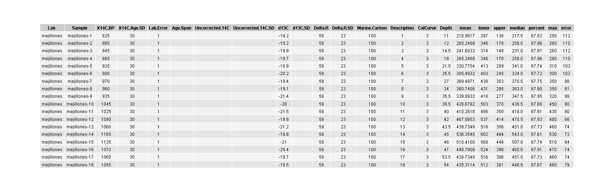

# CalibR

It´s R-script to the same outcome Calib 8.02 for radiocarbon calibration.

## Contents
- [Proposal](#proposal)
- [Instruction](#instruction)
- [R code](#r-code)
- [Reference](#reference)

## Proposal 
This script tries to replicate the radiocarbon calibration of software Calib 8.02 [(1)](#reference) for any Operative system in R programing. therefore, the Data input is the same as Calib 8.02 input. Also, it is able to plot and create output data in a file in the format .csv. Bellow, I attached this script and example of published data Guiñez et al, 2014 [(2)](#reference).

It showed the input table. It's too important to sort data this way.

|[](https://github.com/jasb3110/CalibR/blob/b4b7f34fe5c1becce1b3b3b20495344bc8da6f60/calout/mejillones/mejillones.input.png)|
|:--:| 
|*Table. Input table of Radiocarbon samples pulled out Mejillones core (Guiñez et al. 2014)*|

After that, you can look at the format of the outcome plots. Axis x is a range of calibrated age and axis y is the density probability of calibration. The black, green, and gray lines mean the maximum probability, median, and mean calibrated age, respectively. Also, the blue and red lines mean calibration´s limit according to One standard deviation (one sigma: 68%). sigma value can be changed if you would.

|[](https://github.com/jasb3110/CalibR/blob/ba749dcab638c0243d6a7c11ef361c2016970ddb/calout/mejillones/Core%20mejillones-mejillones-18%20sample%20on%2054cm.png)|
|:--:| 
|*Picture. Outcome plot of sample on 18 cm (Guiñez et al. 2014)*|

Finally, This script is created an outcome table where you are able to find the maximum, median, and mean calibrate age in columns. the outcome table will be saved together with plots [(Table 2.)](calout/mejillones/mejillones.output.png) and I attached a function in source [(3)](https://github.com/jasb3110/CalibR/blob/36366a16fc9cf5e4c5f070f9b17be2f357915dc5/calib.R).

|[](https://github.com/jasb3110/CalibR/blob/b4b7f34fe5c1becce1b3b3b20495344bc8da6f60/calout/mejillones/mejillones.output.png)|
|:--:| 
|*Table 2. Output table of Radiocarbon samples pulled out Mejillones core (Guiñez et al. 2014)*|

## Instruction

1. Select the whole script and pulse Ctrl+ Enter.
2. To wait for its outcomes when you will hear Mario Bross sound the means it is finished. 
3. Bon appetit!!

## R code
```markdown
#########################################################################
#datation for core which was pulled out off Mejillones
library("IntCal")
library("ggplot2")
library("ggh4x")
library("gridExtra")
library("devtools")
library("magrittr")
library("scales")
library("beepr")

dct=getwd()#name of directory
setwd(dct)#directory
# outcome folders
outy="calout"
if (file.exists(outy)) {
  cat("The folder already exists")
} else {
  dir.create(outy)
}

################################
#INPUT
#data is gonna calibrate
d=read.csv("mejillones.csv",sep=";",dec=".",header = TRUE)
################################

dd<- d[-c(1),]

a=0.68# 0.68, 0.95, 0.99 >>>one, two, three sigma
rrr=NULL
rr=NULL
r=NULL
sss=NULL
vvv=NULL
gg=NULL
curv="marine20"
rsv=NULL
sdrsv=NULL
c14=NULL
sdc14=NULL

for(i in 1:length(dd$Sample)){
  rsv=as.numeric(dd$Delta.R[i])
  sdrsv=as.numeric(dd$Delta.R.SD[i])
  c14=as.numeric(dd$X14C.BP[i])
  sdc14=as.numeric(dd$X14C.Age.SD[i])
    if(sum(is.null(c14)==T,is.null(sdc14)==T)>0){
    dd$mean[i]=NA
    dd$lower[i]=NA
    dd$upper[i]=NA
    dd$median[i]=NA
    dd$max[i]=NA
    dd$error[i]=NA
    next()
      }else{
       if(sum(is.na(c14)==T,is.na(sdc14)==T)>0){
         dd$mean[i]=NA
         dd$lower[i]=NA
         dd$upper[i]=NA
         dd$median[i]=NA
         dd$max[i]=NA
         dd$error[i]=NA
         next()
         }else{
          if((c14-sdc14-rsv-sdrsv)<603|(c14+sdc14+rsv+sdrsv)>50000){ 
          next()
          }else{
    assign(paste0("rrr",i),calibrate(age=c14, error=sdc14, cc=curv, prob=a, yr.steps=1, threshold=5e-04, rounded=2, reservoir=c(rsv,sdrsv)))
    assign(paste0("r",i),as.data.frame(get(paste0("rrr",i))[1])[1])
    assign(paste0("rr",i),as.data.frame(get(paste0("rrr",i))[1])[2])
    dd$mean[i]=sum(as.data.frame(get(paste0("rrr",i))[1])[1]*as.data.frame(get(paste0("rrr",i))[1])[2])
    
    if(dim(get(paste0("rrr",i))[[2]])[1]==1){
    dd$lower[i]=get(paste0("rrr",i))[[2]][1]
    dd$upper[i]=get(paste0("rrr",i))[[2]][2]
    dd$median[i]=round(dd$lower[i]*.5+dd$upper[i]*.5)
    dd$percent[i]=get(paste0("rrr",i))[[2]][3]
      }else{
    gg=as.data.frame(get(paste0("rrr",i))[[2]])  
    dd$lower[i]=gg$from[which(gg$perc==max(gg$perc))]
    dd$upper[i]=gg$to[which(gg$perc==max(gg$perc))]
    dd$median[i]=round(dd$lower[i]*.5+dd$upper[i]*.5)
    dd$percent[i]=gg$perc[which(gg$perc==max(gg$perc))]
    }
    if(length(which(get(paste0("rr",i))==max(get(paste0("rr",i)))))==1){
      dd$max[i]=get(paste0("r",i))[1][which(get(paste0("rr",i))[,1]==max(get(paste0("rr",i))[,1])),]
      }else{
      vvv=get(paste0("r",i))[which(get(paste0("rr",i))==max(get(paste0("rr",i)))),]
      sss= abs(vvv-dd$mean[i])
      dd$max[i]= vvv[which(sss==min(sss))]
    }
    dd$error[i]=max(abs(dd$lower[i]-dd$max[i]),abs(dd$max[i]-dd$upper[i]))
        }
      }
    }
}

#plotting in low resolution 
#for( i in 1:length(dd$Sample)){  
#X11();plot(as.data.frame(get(paste0("rrr",i))[1])[[1]],as.data.frame(get(paste0("rrr",i))[1])[[2]] ,type="l",xlab="Cal BP",ylab="Density",main =dd$Sample[i])
#  abline(v=dd$mean[i],col="gray")#mean value
#  abline(v=dd$lower[i],col="blue")# lower value
#  abline(v=dd$upper[i],col="red")#upper value
#  abline(v=dd$median[i],col="green")#median value
#  abline(v=dd$max[i],col="black")#maximum probability value
#}  

###########################################
#create or open folder with specified name
file=paste0(dct,"/",outy)
setwd(file)
f=dd$Lab[i]
if (file.exists(f)) {
  cat("The folder already exists")
} else {
  dir.create(f)
}
#outcome folder
folder=paste0(file,"/",f)
setwd(folder)
###########################################

labely=expression(paste("Density (",10^-3,")"))

c14=NULL
sdc14=NULL
rsv=NULL
sdrsv=NULL
plot=NULL

for( i in 1:length(dd$Sample)){
  rsv=as.numeric(dd$Delta.R[i])
  sdrsv=as.numeric(dd$Delta.R.SD[i])
  c14=as.numeric(dd$X14C.BP[i])
  sdc14=as.numeric(dd$X14C.Age.SD[i])
  
  if(sum(is.null(c14)==T,is.null(sdc14)==T)>0){
    dd$mean[i]=NA
    dd$lower[i]=NA
    dd$upper[i]=NA
    dd$median[i]=NA
    dd$max[i]=NA
    dd$error[i]=NA
    warning(paste0("Can´t calibrate dates: null value"))
    next()
    }else{
      if(sum(is.na(c14)==T,is.na(sdc14)==T)>0){
      dd$mean[i]=NA
      dd$lower[i]=NA
      dd$upper[i]=NA
      dd$median[i]=NA
      dd$max[i]=NA
      dd$error[i]=NA
      warning(paste0("Can´t calibrate dates: NA value"))
      next()
      }else{
      if((c14-sdc14-rsv-sdrsv<603)|(c14+sdc14+rsv+sdrsv>50000)){ 
        warning(paste0("Can´t plotted date beyond calibration curve!: Convencial age ",dd$X14C.BP[i],"\u00B1",dd$X14C.Age.SD[i]))
        next()
        }else{
          
          png(paste0(dd$Sample[i],".plot.png"),width = 200, heigh = 200, units = 'mm', res =1200)
          calibrate(age=c14, error=sdc14, cc=curv, prob=a, yr.steps=1, threshold=5e-04, rounded=2, reservoir=c(rsv,sdrsv))
          dev.off()
          
          dr=as.data.frame(get(paste0("rrr",i))[1])
          dr[[2]]=1000*dr[[2]]
        
          plot=ggplot(data=dr, aes(x=dr[[1]], y=dr[[2]])) + geom_line()+
                theme_classic()+
                
                geom_segment(aes(y =0,
                                 yend =dr$V2[which(dr$cal.BP==trunc(dd$mean[i]))][1],
                                 x=dd$mean[i] ,
                                 xend=dd$mean[i] ),color = "gray", size=.5)+
                
                geom_segment(aes(y =0,
                                 yend =dr$V2[which(dr$cal.BP==dd$lower[i])][1],
                                 x=dd$lower[i],
                                 xend=dd$lower[i]),color = "blue", size=.5)+
                
                geom_segment(aes(y =dr$V2[which(dr$cal.BP==dd$lower[i])][1],
                                 yend =dr$V2[which(dr$cal.BP==dd$lower[i])][1],
                                 x=max(dr$cal.BP),
                                 xend=dd$lower[i]),color = "blue", size=.5)+
                annotate("text",x=max(dr$cal.BP)*.5+dd$lower[i]*.5,y=dr$V2[which(dr$cal.BP==dd$lower[i])][1]*.95,label="Lower",size = 3,col="blue")+
             
                geom_segment(aes(y =0,
                                 yend =dr$V2[which(dr$cal.BP==dd$upper[i])][1],
                                 x=dd$upper[i],
                                 xend=dd$upper[i]),color = "red", size=.5)+
                
                geom_segment(aes(y =dr$V2[which(dr$cal.BP==dd$upper[i])][1],
                                 yend =dr$V2[which(dr$cal.BP==dd$upper[i])][1],
                                 x=min(dr$cal.BP),
                                 xend=dd$upper[i]),color = "red", size=.5)+
                
                annotate("text",x=min(dr$cal.BP)*.5+dd$upper[i]*.5,y=dr$V2[which(dr$cal.BP==dd$upper[i])][1]*.95,label="Upper",size = 3,col="red")+
            
                
                geom_segment(aes(y =0,
                                 yend =dr$V2[which(dr$cal.BP==trunc(dd$median[i]))][1],
                                 x=dd$median[i] ,
                                 xend=dd$median[i] ),color = "green", size=.5)+
                
                geom_segment(aes(y =0,
                                 yend =dr$V2[which(dr$cal.BP==trunc(dd$max[i]))][1],
                                 x=dd$max[i] ,
                                 xend=dd$max[i] ),color = "gray30", size=.5)+
                
                annotate("text",x=dd$mean[i],y=quantile(dr$V2)[2],label="Mean",size = 3,col="gray40",angle='90')+
                annotate("text",x=dd$median[i],y=quantile(dr$V2)[3],label="Median",size = 3,col="#66CC99",angle='90')+
                annotate("text",x=dd$max[i],y=quantile(dr$V2)[4],label="Maximum",size = 3,col="black",angle='90')+
                
                scale_x_continuous(limits = c(.99*min(dr$cal.BP),1.01*max(dr$cal.BP)),breaks =scales::pretty_breaks(n = 5),guide = "axis_minor")+
                scale_y_continuous(limits = c(0,1.01*max(dr$V2)),breaks =scales::pretty_breaks(n = 5),guide = "axis_minor")+
                annotate("text",x=quantile(dr[[1]])[4]*.5+quantile(dr[[1]])[5]*.5,y=quantile(dr[[2]])[5]*.99*1.01,label=paste0(dd$Lab[i]," sample on ",dd$Depth[i],"cm"), size = 4,col="black")+
                annotate("text",x=quantile(dr[[1]])[4]*.5+quantile(dr[[1]])[5]*.5,y=quantile(dr[[2]])[5]*.96*1.01,label=paste0("Cal.age: ",dd$max[i],"\u00B1",dd$error[i]), size = 4,col="black")+
                annotate("text",x=quantile(dr[[1]])[4]*.5+quantile(dr[[1]])[5]*.5,y=quantile(dr[[2]])[5]*.93*1.01,label=paste0("\u0394R = ",dd$Delta.R[i],"\u00B1",dd$Delta.R.SD[i]), size = 4,col="black")+
                annotate("text",x=quantile(dr[[1]])[4]*.5+quantile(dr[[1]])[5]*.5,y=quantile(dr[[2]])[5]*.90*1.01,label=paste0("Probability: ",trunc(100*dd$percent[i])/100,"%"), size = 4,col="black")+
                annotate("text",x=quantile(dr[[1]])[4]*.5+quantile(dr[[1]])[5]*.5,y=quantile(dr[[2]])[5]*.87*1.01,label=paste0("Cal. curve: ",curv), size = 4,col="black")+
                labs(title=paste0("Relative probability of sample "),x ="Cal yr BP", y = labely)
                theme(xis.ticks.length=unit(0.25,"cm"),ggh4x.axis.ticks.length.minor = rel(0.5),axis.ticks = element_line(size = 2),ggh4x.axis.ticks.length.minor = rel(0.5),axis.text.x=element_text(size=11,colour = "black",face="bold",angle=45, hjust=1),axis.text.y=element_text(size=11,colour = "black",face="bold",hjust=1),
                      axis.title=element_text(size=14,face="bold"),title = element_text(size=16,colour = "black",face="bold"))
              
                ggsave(paste0("Core ",dd$Lab[i],"-",dd$Sample[i]," sample on ",dd$Depth[i],"cm.png"), dpi = 900,   width = 250,
                       height = 159,unit="mm",plot =plot) 
    }    
   }
  }
 }
#OUTCOME
l=c("Lab code", "Sample code",expression(phantom()^14*C~"\n(yrs BP)"),           
expression(phantom()^14*C~SD~"\n(yrs BP)"), "Lab Error", "Age Span",          
"Uncorrected~delta^14*C","Uncorrected~SD~delta^14*C","delta^13*C",              
"delta^13*C~SD" ,"Delta*R~(yrs)" ,            
"Delta*R~SD~(yrs)","Marine carbon\n(%)","Description","Calibration~curve",          
"Depth~(cm)")

dd$mean=round(dd$mean)
write.csv(dd,paste0(dd$`Lab`[i],".calibrated.csv"),sep=",",dec=".",col.names = TRUE)

#plot input table
d1<- d[-c(1),]
colnames(d1)=l
myt=ttheme_minimal(base_size = 12, base_colour = "black", base_family = "",
                   parse = T , padding = unit(c(2,2), "mm"),colhead=list(fg_params = list(parse=TRUE), fontface=4L,bg_params=list(fill="gray90")))

png(paste0(dd$`Lab`[1],".input.png"), width = ncol(d1)*500/16, heigh = 180/19*nrow(d1), units = 'mm', res =1200)
grid.table(d1,rows = NULL,theme=myt)
dev.off()

colnames(dd)[1:length(l)]=l
#plot output table
png(paste0(dd$`Lab code`[1],".output.png"), width = ncol(dd)*500/23, heigh = 180/19*nrow(dd), units = 'mm', res =1200)
grid.table(dd,rows = NULL,theme=myt)
dev.off()

setwd(dct)
end=Sys.time() 
tem=end-begin
cat("Working time was estimated how", sep="\n\n")
print(tem)
cat(paste0("Calibration finished of ",dd$`Lab code`[i]," successfully!!", sep="\n\n"))
beep(8)#mario bros sound
################################################################################
```
## Reference

Stuiver, M., & Reimer, P. J. (1993). EXTENDED 14C DATA BASE AND REVISED CALIB 3.014C AGE CALIBRATION PROGRAM. Radiocarbon, 35(1), 215–230. https://doi.org/10.14210/bjast.v17.n2.pNB5-8

Guiñez, M., Valdés, J., Sifeddine, A., Boussafir, M., & Dávila, P. M. (2014). Anchovy population and ocean-climatic fluctuations in the Humboldt Current System during the last 700 years and their implications. Palaeogeography, Palaeoclimatology, Palaeoecology, 415, 210–224. https://doi.org/10.1016/j.palaeo.2014.08.026
